Cloud Deployment 
*************************

Mist has a high `device requirements <./device.html>_` 
for computing resourses, especially in GPU. When your local device
is not good enough, we recommend you to deploy and use Mist on cloud.
Concretely, cloud deployment means that users install Mist on
cloud server rented from GPU cloud service. Since cloud servers are
of high grade and on demand, it would benefit users who lack of
computing resources good enough for deploying Mist locally.

**Note**: cloud servers are **on demand**. Please **shut down them as soon as
they complete the task**.

In this section, we will give the instruction in how to rent a cloud server
and deploy Mist on it. We use Runpod as the example, since
it is one of the cheapist cloud services. 

The whole deployment can be separated
into three steps. First, rent a cloud server from RunPod. Second, download the
source code and install Mist. Third, boot Mist.

Rent a cloud server
==========================

Access the homepage of `RunPod <runpod.io>`_. Click on 'Sign Up' or 'Login' to register
or log in your account.

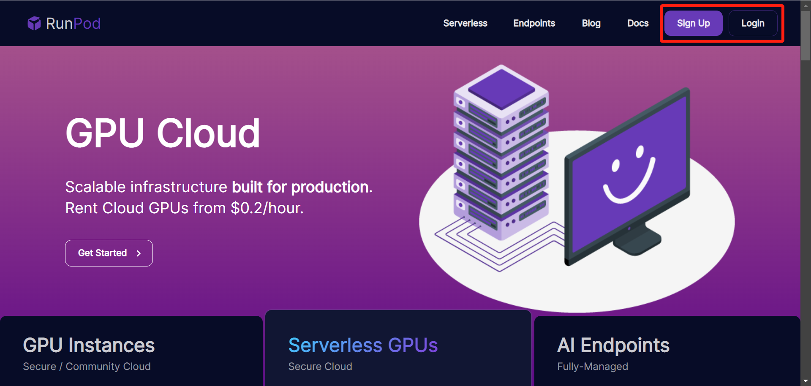
   
\

After logging in, you will see the console. Click on 'My Template' in the left
column, then the 'New Template' button.

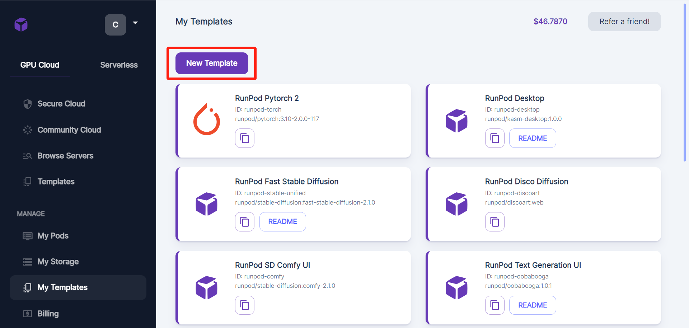
   
\

Fill the configuration table as following.

::

        Container Image: public.ecr.aws/f9c5c8j0/mist-with-model:latest
        Docker Command: bash -c 'sleep infinity'

Then click on the 'Save Template' button.

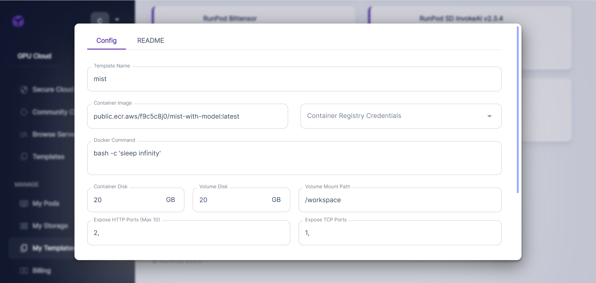
   
\

You will find a new template called mist at the bottom of the template list.
Note that if you have created the template before, you do not need to create
it again.

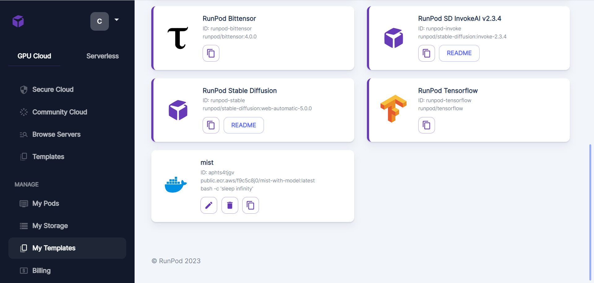
   
\

After creating the template, you can now rent a cloud server with the
template. Click on 'Secure Cloud' in the left column. 

Here lists the configuration of various cloud servers. Check our `device requirements <./device.html>`_ and select the server with appropriate configuration. Here, we choose
a server with RTX A5000. Click on the 'Deploy' button to rent the server.

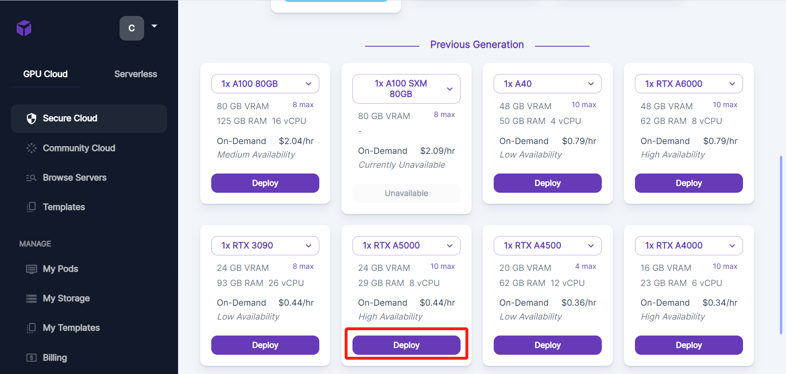
   
\

Choose 'mist' in the option box 'Select a Template'. Then click on 'Continue'.

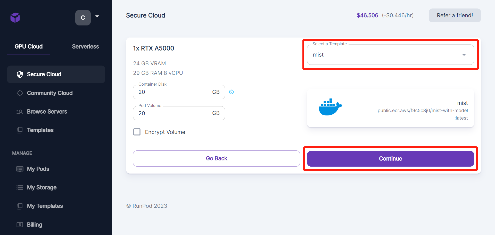
   
\

Click on 'Deploy'.

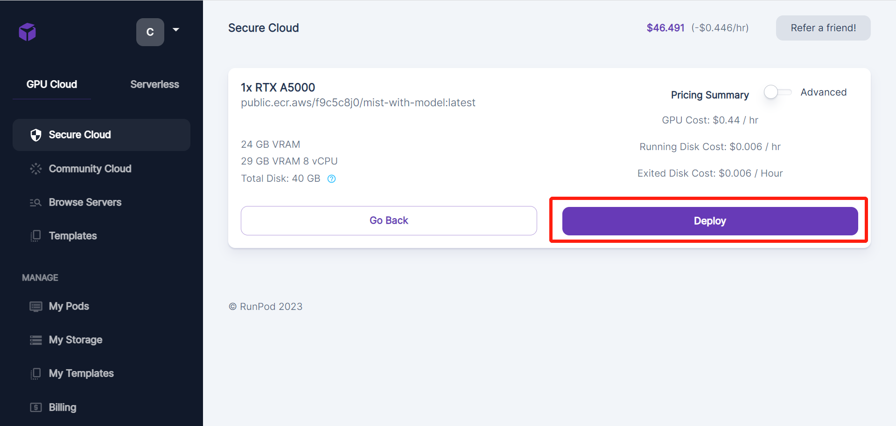
   
\

Turn to the UI 'My Pod' by clicking on 'My Pod' in the left column.
You can see the progress to build the cloud server.

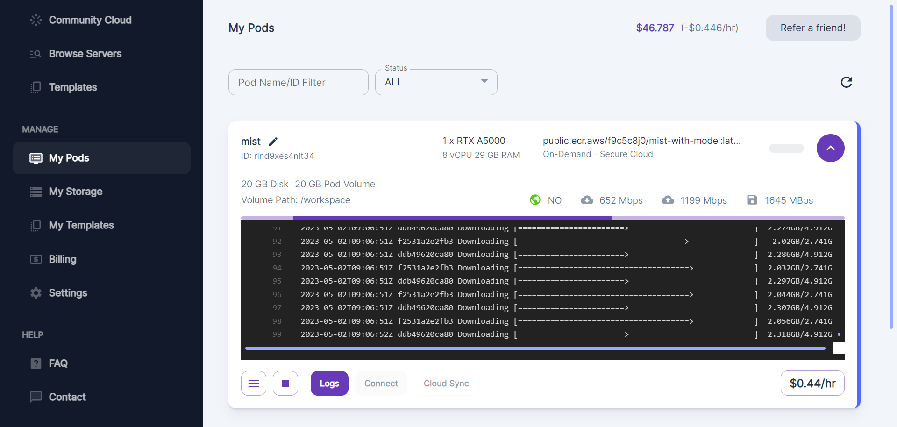
   
\

Wait for a while until the server is built. Click on 'Connect'.

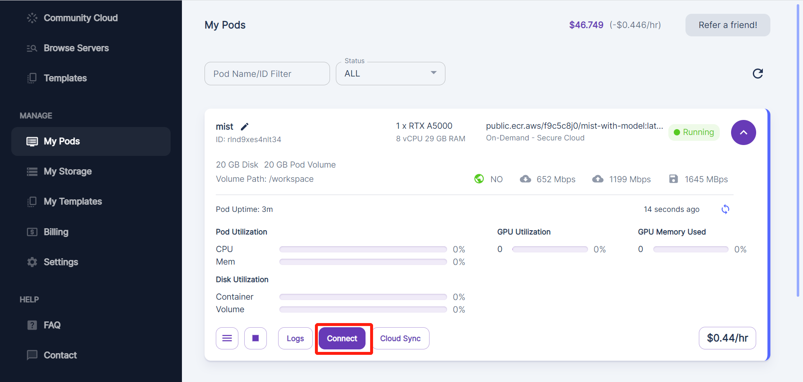
   
\

In 'Connection Options', click on 'Start Web Terminal'.

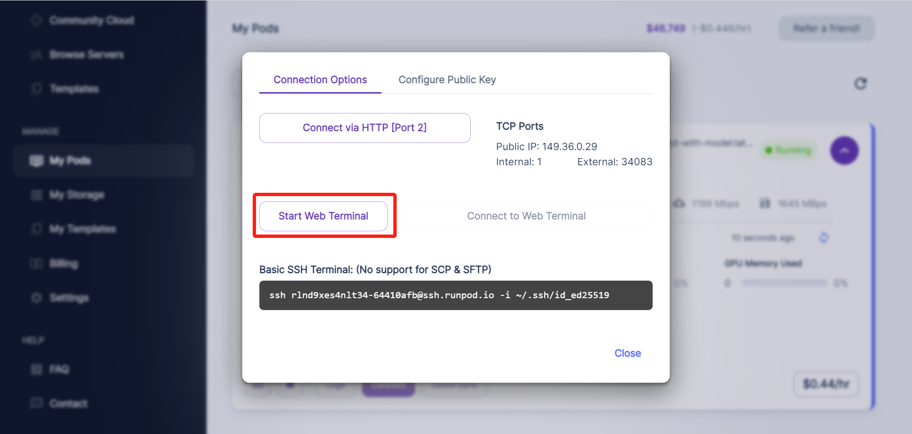
   
\

Click on 'Connect to Web Terminal'.

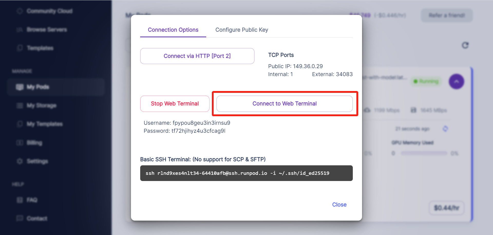
   
\

In the new created page, you can see the command line of the cloud server.
That is where you operate the cloud server and run Mist. 

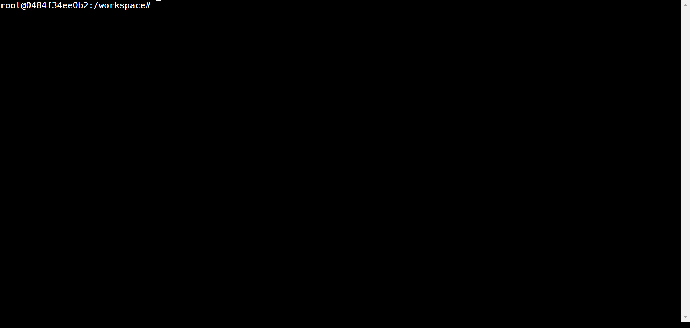
   
\

Deploy Mist
===================

Download and install two necessary packages via following commands.

::

        apt-get update
        apt-get install wget
        apt-get install git

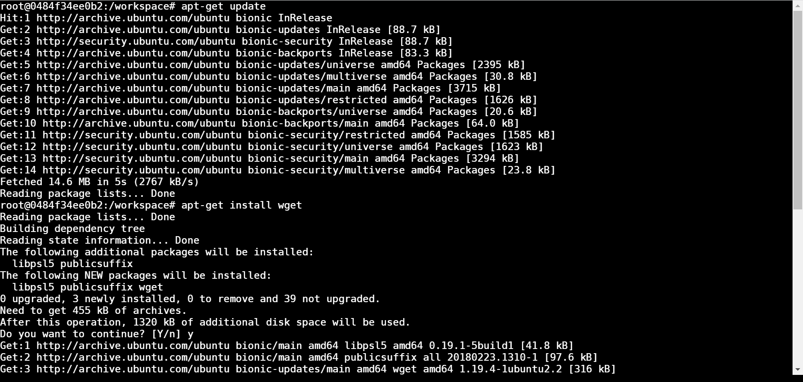
   
\

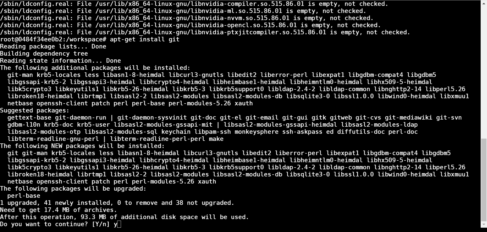
   
\

Clone the source code of Mist to the ``workspace`` directory. Then reinstall
``pillow`` by pip.

::

        git clone https://github.com/mist-project/mist.git
        pip install --force-reinstall pillow

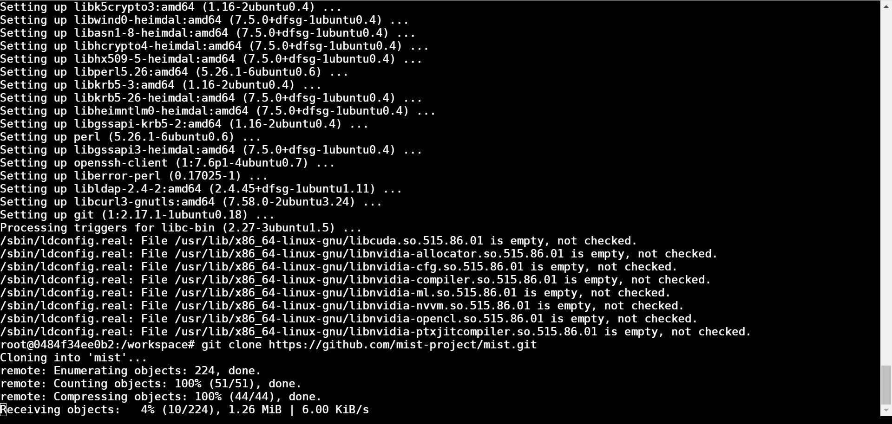
   
\

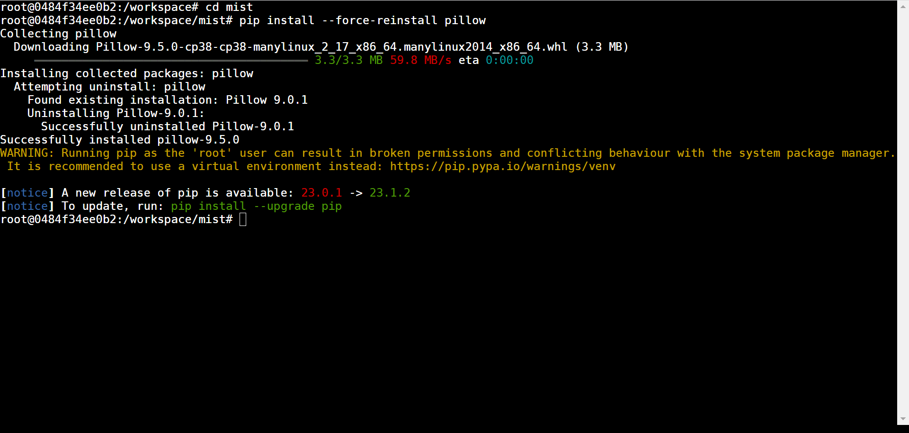
   
\

Get into the ``mist`` directory and download the clip model from huggingface.

::

        wget -c https://huggingface.co/CompVis/stable-diffusion-v-1-4-original/resolve/main/sd-v1-4.ckpt

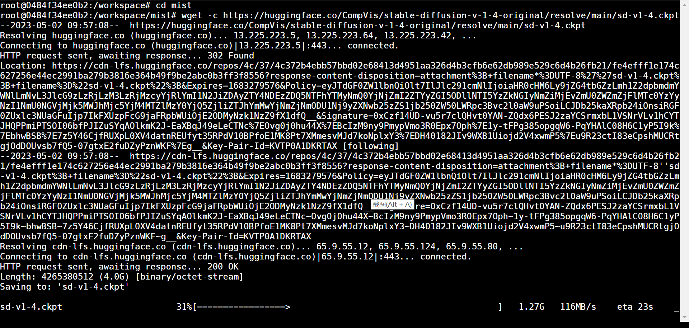
   
\

Move the model to the correct location.

::

        mkdir -p  models/ldm/stable-diffusion-v1
        mv sd-v1-4.ckpt models/ldm/stable-diffusion-v1/model.ckpt

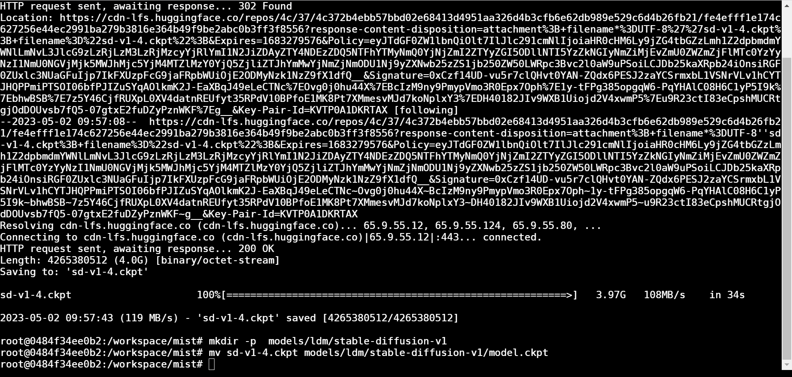
   
\

Now you have all installation completed. In the next part, we will
talk about the usage of Mist on cloud.

Use Mist on cloud
========================

In the ``mist`` directory, use the following command to run Mist.

::

        python mist_v3.py --input_dir_path test/vangogh --output_dir vangogh

where the input images are placed in ``./test/vangogh`` and the output images
would be placed in ``./output/dir/vangogh_{A}_{B}_{C}``. Here, ``{A}``, ``{B}``, 
and ``{C}`` means some parameters of Mist used to process these output images.
Note that the ``input_dir_path`` can be modified to any directories in the
``mist`` directory.

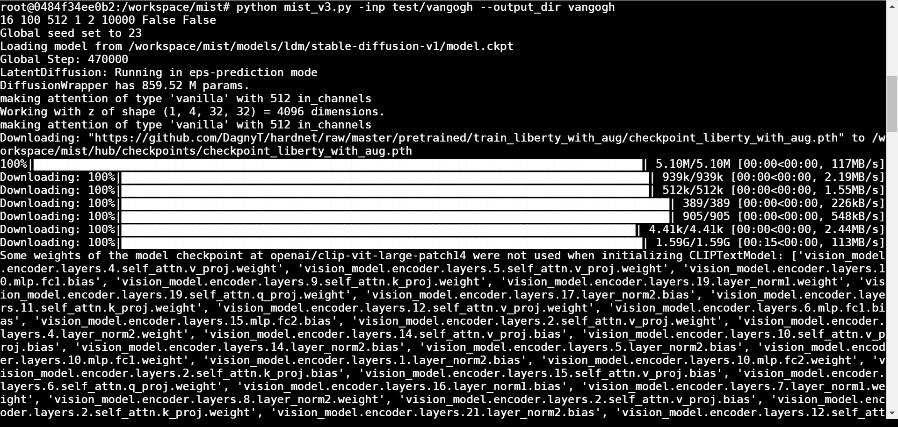
   
\

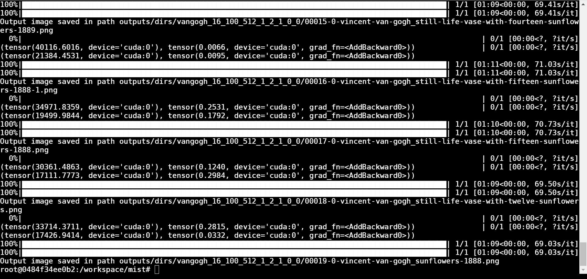
   
\

For description and recommended values of the parameters, see the table
at the bottom of `mode and parameters <./mode.html>`_.
The parameters can be modified by adding a prefix and the value to the command. Fox example, 
if you want to set the value of the parameter epsilon as 8, use the following
command:

::

        python mist_v3.py --input_dir_path test/vangogh --output_dir vangogh --epsilon 8

Here, we give a table to demonstrate the prefix used in the command for each parameter.

+---------------+-------------------+-------------------------------------------------------------------+
| Parameter     |      Prefix       | Note                                                              |
+===============+===================+===================================================================+
| Strength      |  --epsilon        | Default: 16                                                       |
+---------------+-------------------+-------------------------------------------------------------------+
| Steps         |  --steps          | Default: 16                                                       |
+---------------+-------------------+-------------------------------------------------------------------+
| Output size   |  --input_size     | Default: 16                                                       |
+---------------+-------------------+-------------------------------------------------------------------+
| Fused weight  |  --rate           | Default: 16                                                       |
+---------------+-------------------+-------------------------------------------------------------------+
| Low VRAM Mode |  --block_num      | 1 means normal mode. 2 means Low VRAM mode. Default: 1.           |
+---------------+-------------------+-------------------------------------------------------------------+

Now, you can boot Mist to process your images. To upload your images to the cloud server, click on
"Cloud Sync" in the following page.

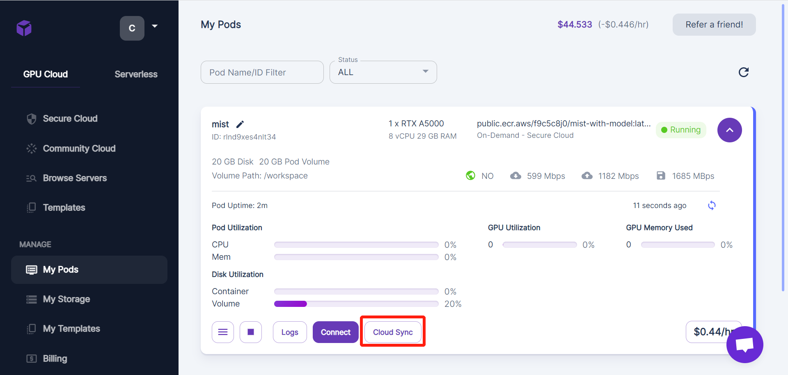
   
\

You can choose a convenient approach from these approaches to share your images
to the cloud server.

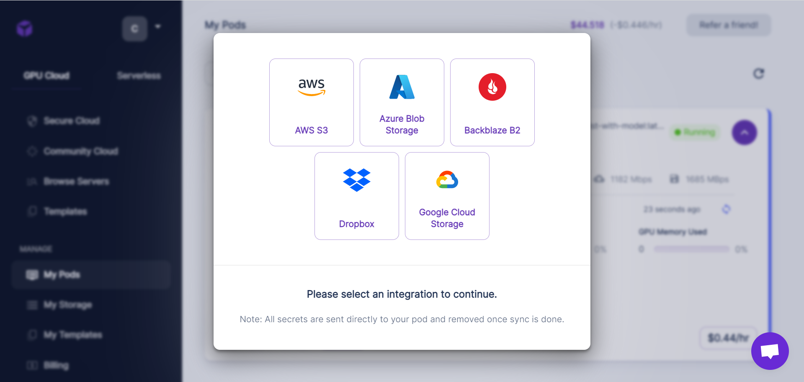
   
\