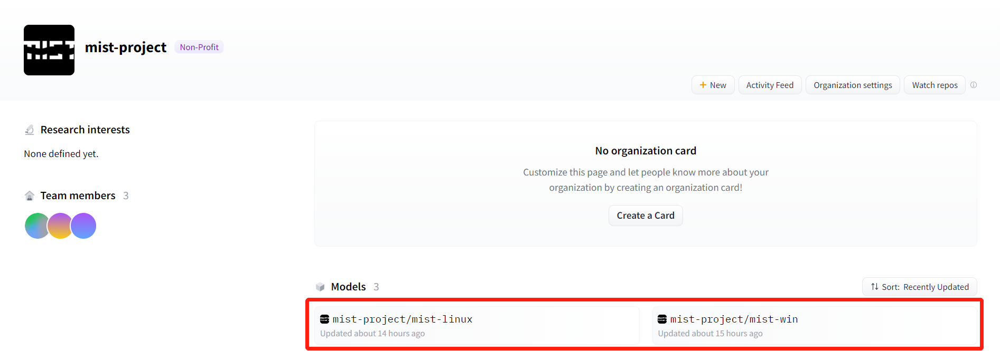

Quick Start
*****************

Installation
=======================

Mist is compatible with both Windows and Linux. The installation files for Mist on both 
Windows and Linux are available on
`Huggingface <https://huggingface.co/mist-project>`_. 

To install Mist, select the Mist project consistent with your computer system. 
Here, we will continue the installation instruction with the Windows system as an example. 
Left click the name of the project.

\

Access 'Files and versions' in the project page and find the zip file. Left click the zip file.

.. image:: ../media/fig-quickstart-2.png
   :align: center
   :alt: fig_cbscenario

\

Left click 'download'. The zip file will begin to download to your computer.

.. image:: ../media/fig-quickstart-3.png
   :align: center
   :alt: fig_cbscenario

\

After the zip file is downloaded, unzip the zip file and access the 'mist-webui-v1.0-win-release' 
directory. Now you have completed the installation of Mist. To launch Mist, left click 'mist-webui.exe'.

Usage
=======================

Left click on 'mist-webui.exe' and you will see a command prompt window. Wait minutes until it
shows off following prompts.

.. image:: ../media/fig-quickstart-7.png
   :align: center
   :alt: fig_cbscenario

\

If you are running Mist locally, copy the local link (http://127.0.0.1:7860) 
in the prompts and paste it to your browser. The working page of Mist will appear. 
If you are starting up a Mist server, the public link in the prompts other than local 
link can be used to access Mist remotely. 

.. image:: ../media/fig-quickstart-4.png
   :align: center
   :alt: fig_cbscenario

\

The working page is divided into four different sections, marked as A, B, C, 
and D in the following figure. The watermarking process of Mist involves four steps. 
First, select the image to be watermarked by left clicking A. Second, 
adjust the parameters and choose the appropriate mode  in B. See the part 
*Modes and Parameters* 
in the documentation for instructions. Third, left click the button 'Mist' in C to initiate
the watermarking process. Forth, after several minutes, you can download the misted image in D.

.. image:: ../media/fig-quickstart-5.png
   :align: center
   :alt: fig_cbscenario

\

.. image:: ../media/fig-quickstart-6.png
   :align: center
   :alt: fig_cbscenario

\

