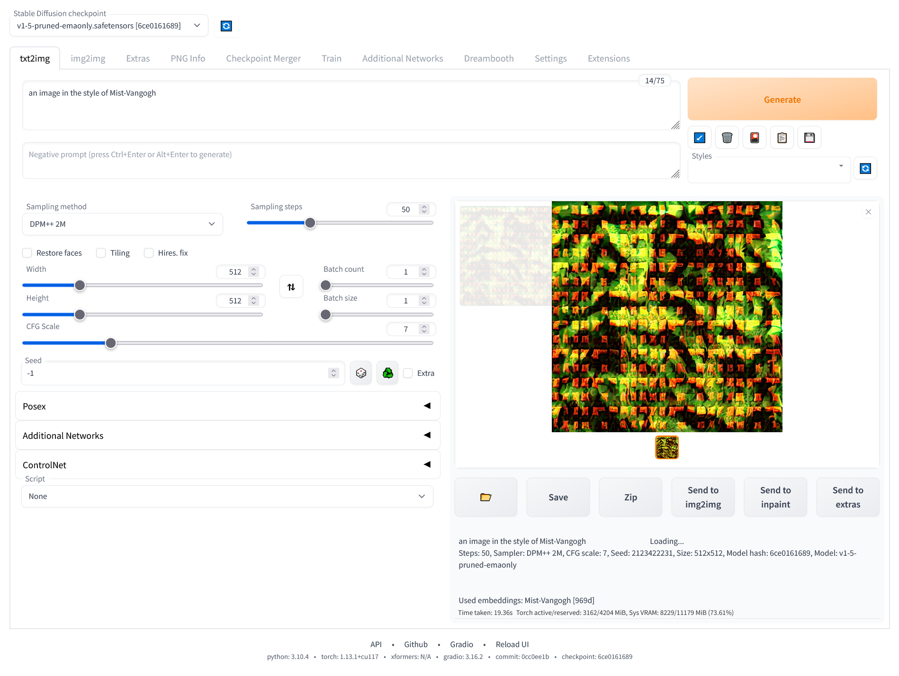
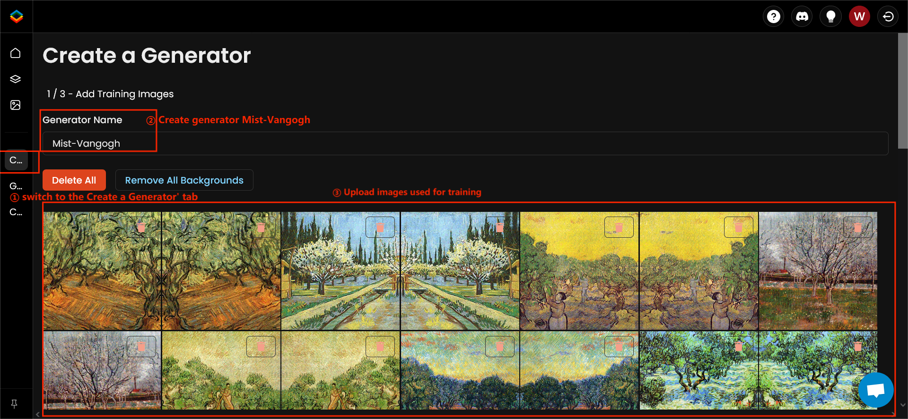
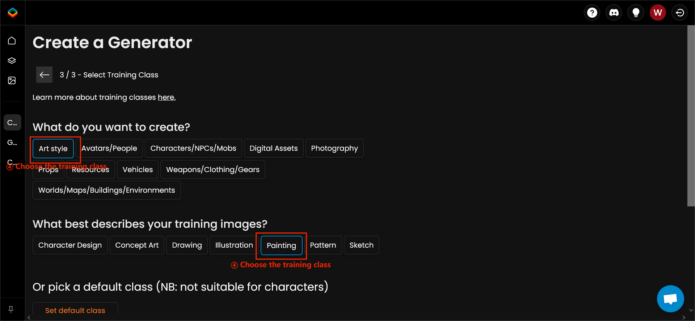
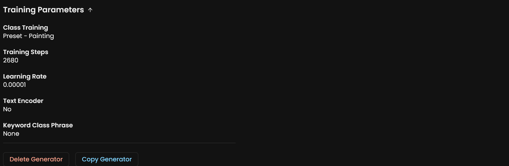
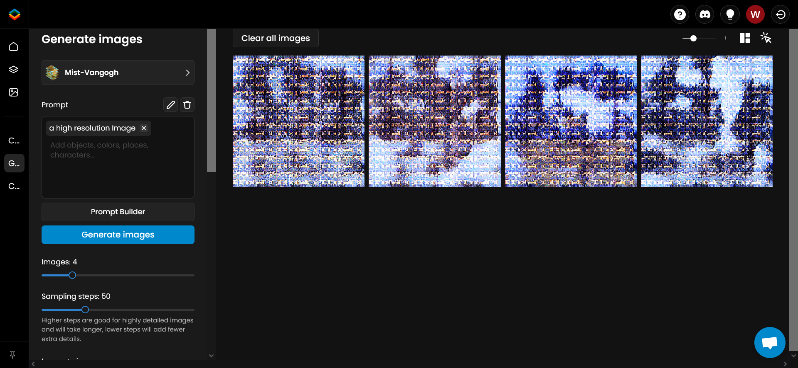

Validation
*****************

Mist works on various AI-for-Art applications. To help users validate the performance
of Mist quickly, we detail the steps of validation in this guideline. 

A package of example images that can be used for validation are also available on 
`Google Drive <https://drive.google.com/drive/folders/1AlRWoEpujYjieqqu3sEQIrH4eoxf0ppA?usp=share_link>`_. 
In the package, images in "training" directory 
are used for validation on Textual Inversion, Dreambooth and Scenario.gg. Images in "Img2Img" directory
are used for testing under NovelAI. You can also use your own images for validation. 
Next, we would illustrate the pipeline to validate Mist in various
AI-for-Art applications.

Textual Inversion
=======================
Textual inversion is a tool that can summarize the input images using a pseudo-word for further style transferring. To reproduce our result, you can try access textual inversion through the open-source Stable-diffuion-webui on `GitHub <https://github.com/AUTOMATIC1111/stable-diffusion-webui>`_. 

Access the textual inversion tab; Create a new embedding called Mist-Vangogh with initialization text set as style * and number of vectors per token fixed to 8.

.. image:: ../media/Fig-train-1-text.png
   :align: center
   :alt: fig_cbscenario

\

Then train the embedding for 6,000 steps with the images processed by Mist.

.. image:: ../media/Fig-train-2-text.png
   :align: center
   :alt: fig_cbscenario

\

After training, you can generate images in either Img2Img or txt2img tab by adding prompt: "An image in the style of Mist-Vangogh"

\

NovelAI Img2Img
=======================
NovelAI is an online commercial websites supporting  `Img2Img generation <https://novelai.net/image>`_.  Use NAI Diffusion Anime and fix the prompt to "woman with a Parasol, high resolution, outdoor, flowers, blue sky", the solution to 512, the random seed to 1255, the steps to 40, the guidance to 11, and the sampler to DPM++ 2M. Then we change the strength to 0.25, 0.35 and 0.5 respectively. 

.. image:: ../media/novelai.png
   :align: center
   :alt: fig_cbscenario

\

Dreambooth
=======================

Dreambooth is a method that can retrain the Stable Diffusion for customized generation. We use the dreambooth training scripts provided by `diffuser <https://huggingface.co/docs/diffusers/training/dreambooth>`_. Vangogh images processed by Mist are used to retrain both the unet and the text_encoder of `Stable diffusion v1.4 <https://huggingface.co/CompVis/stable-diffusion-v1-4>`_ with a learning rate fixed to 2e-6 and max training steps fixed to 2000. The code below is our script for training Dreambooth.

.. code-block::
    
    export MODEL_NAME="CompVis/stable-diffusion-v1-4"
    export INSTANCE_DIR="../Mist_Vangogh"
    export OUTPUT_DIR="dreambooth/Mist_Vangogh/"

    accelerate launch train_dreambooth.py \
      --pretrained_model_name_or_path=$MODEL_NAME  \
      --instance_data_dir=$INSTANCE_DIR \
      --output_dir=$OUTPUT_DIR \
      --instance_prompt="a painting style" \
      --resolution=512 \
      --train_batch_size=1 \
      --gradient_accumulation_steps=1 \
      --learning_rate=2e-6 \
      --lr_scheduler="constant" \
      --lr_warmup_steps=0 \
      --max_train_steps=2000 \
      --train_text_encoder \

You can also try   `dreambooth extension of SDM webui <https://github.com/d8ahazard/sd_dreambooth_extension>`_ ,  which should produce similar results.

Scenario.gg
=======================
`Scenario <https://app.scenario.com/>`_.gg is a website supporting customized generator. First, access to the 'Create a Generator' tab. Then use the Vangogh images processed by Mist to train the generator. We use the auto training mode provided by scenario.gg and set the training class as Art style - Painting.

\

\

It is important to note that the default parameter for training in scenario.gg may change from time to time. For reference, the default parameters by the time we test Mist on scenario.gg are listed below:

\

Then you can generate images based on Mist-Vangogh using the 'Generate Images' Tab.

\